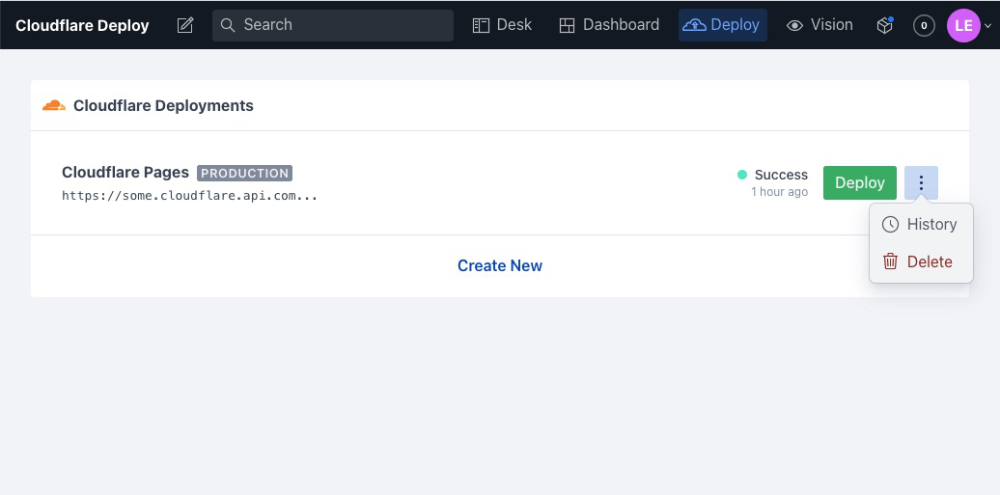

<h3 align="center">
  Cloudflare Pages Deployment Plugin for Sanity Studio
</h3>
<p align="center">
  <strong>Trigger Cloudflare Pages Deploys from your Sanity Studio.</strong><br />
✨ LIVE status updates ✨ multiple deployments ✨ active polling ✨
</p>



## Install

Run the following command in your studio folder using the Sanity CLI:

```sh
sanity install cloudflare-deploy
```

⚠️ **Note:** If your Studio is not using the `@sanity/dashboard` part, you'll need to manually install this as well:

```sh
sanity install @sanity/dashboard
```

## Your first Cloudflare Pages Deployment

Once installed, you should see a new "Deploy" tool in your Sanity Studio navbar.

Create a new deployment by clicking `Create New`.

Next, you'll be prompted to add the following:

> **`Display Title`**<br />
> A name for your deployment. This can be whatever you want, to help you organize your deployments. Typically, this should be the environment you are deploying to, like `Production` or `Staging`.

> **`Cloudflare Project Name`**<br />
> This is the actual Project Name listed in your Cloudflare account. Navigate to your Project Settings within Cloudflare Pages to find your Project Name.

>> **`Cloudflare API URL (Proxy)`**<br />
> This is the API Endpoint URL where the requests should be sent to by the plugin. For more information why this is necessary look at the CORS section of this README [here](#cloudflare-cors). This can also be specified with port and must not end with a trailing slash at the end.

> **`Cloudflare Email`**<br />
> The Email of your Cloudflare account. Necessary for logging in via HTTP headers.

> **`Cloudflare API key`**<br />
> This is a token from your Cloudflare Account (not project). Navigate to your Account Settings, and click on show Global API Key to reveal the current key. Unfortunately, it is not possible to use Cloudflare API tokens to access the Pages API. If Cloudflare manages to implement this, just give me a hint and write me an email or open an issue so I can fix this. In the meanwhile get your Global API Key [here](https://dash.cloudflare.com/profile/api-tokens).

😎 Once you've created your deployment you can now trigger deploys at anytime!

## Cloudflare CORS

As it is not possible to access Cloudflare Pages Deployments at the moment via API Tokens, we have to utilize the Cloudflare Global API Key which is only accessible via Email and API Key in the HTTP-Header like described [here](https://developers.cloudflare.com/pages/platform/api). Another problem is the missing CORS functionality when accessing the Cloudflare API. For this reason I created a minimal Cloudflare Worker script that passthroughs only the needed API-requests and sets the according CORS headers. Deploying a Worker Script is really straightforward and can also be done in the browser. A simple template from me that should do the job can be found [here](https://github.com/estallio/cloudflare-pages-deployments-api-proxy).

## License

### MIT

> Github [@estallio](https://github.com/estallio) &nbsp;

##### Originally written for Vercel by:

> [nickdimatteo.com](https://nickdimatteo.com) &nbsp;&middot;&nbsp;
> Github [@ndimatteo](https://github.com/ndimatteo) &nbsp;&middot;&nbsp;
> Instagram [@ndimatteo](https://instagram.com/ndimatteo)
